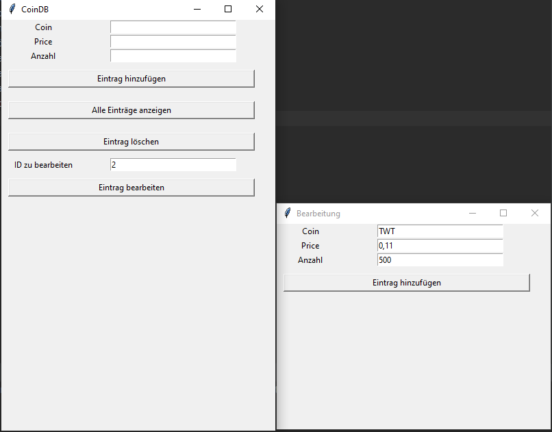

Es ist eine App zu erstellen, die folgende Themen berührt:
- Erstellung von Database 
- Erstellung von GUI mit TKinter Framework
- Folgende Funktionen sind zu implementieren
  - Einträge speichern 
  - Einträge anzeigen
  - Einträge löschen 
  - Einträge bearbeiten 
- Folgende Exceptions sind zu behandeln
  - leere Eingabe
  - string anstatt int bzw. float
  

